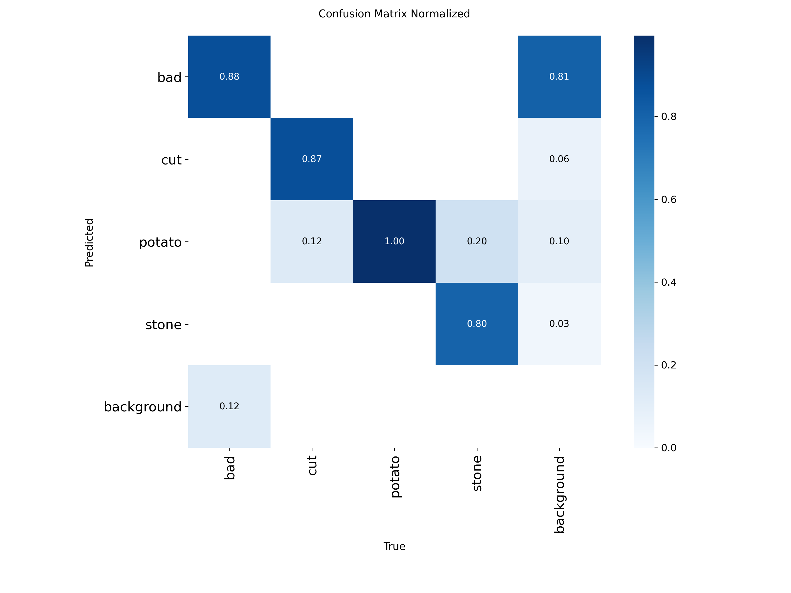
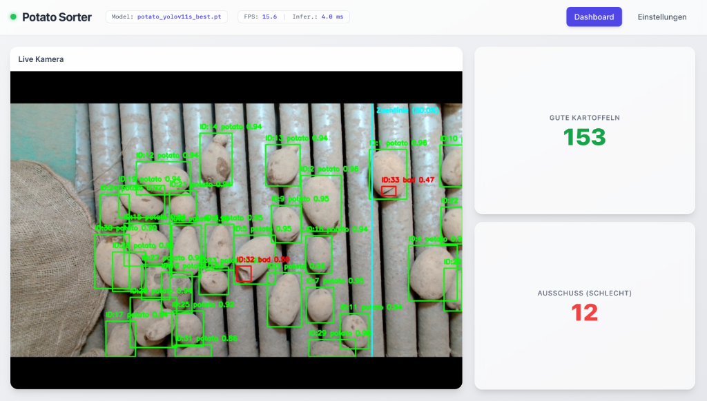

# dhbw-kartoffel-sortierung (Potato Sorting)

## Project Overview

This project is part of a final university course project. The goal is to address a real-world agricultural use case using Machine Learning and Computer Vision methods.

The use case originates from a potato farm, where potatoes are currently sorted manually. The process involves distinguishing between usable potatoes, damaged or bad potatoes, and stones or foreign objects. Manual sorting is time-consuming and labor-intensive. The aim of this project is to support or partially automate this process using an image-based system.

 Preview |  |
| :---: | :---: |
| <video src="https://github.com/user-attachments/assets/ec5508cb-a7b4-466c-a3cf-77761cf79596" autoplay loop muted playsinline></video> | <video src="https://github.com/user-attachments/assets/e2c4a289-2a9f-4188-928f-dd7339a078a1" autoplay loop muted playsinline></video> |

## Problem Statement

The project investigates whether potatoes and unwanted objects on a conveyor belt can be reliably detected and classified using Computer Vision.

Currently, we are considering an Object Detection setup with the following classes:

- `potato`
- `bad`
- `cut`
- `stone`

An open technical question is whether `cut` should remain a separate class in the long run or be treated as a subcategory of `bad`.

## Objectives

The project goal is the development and evaluation of a prototype for the automatic detection and sorting of potatoes and foreign objects in images of a conveyor belt setup.

In particular, the following questions are to be answered:

- Is Object Detection suitable for this use case?
- Which model architecture delivers the best results on the available dataset?
- How representative is the current dataset for future real-world application?
- What are the weaknesses, biases, and limitations of the dataset?
- Which metrics are suitable for evaluating the system?

## Dataset

> **Detailed insights into the physical setup, camera angles, and the image acquisition process can be found in the [Project Preparations](docs/projekt_vorarbeiten.md#3-image-acquisition-setup)**
> 
> **The dataset is publicly available as an open-source project on Roboflow Universe:**
> **[Potato Sorting on Conveyor Dataset](https://universe.roboflow.com/ms-workspace-m1gci/potato-sorting-on-conveyor)**

The current dataset was managed in Roboflow and currently contains:

- `855` images
- `17,511` annotations
- `4` classes
- an average of `20.5` objects per image
- image resolution predominantly `1920 x 1080`

Current class distribution:

- `potato`: 16,271
- `stone`: 778
- `bad`: 399
- `cut`: 63

Class distribution in the evaluation splits (real instances, from the YOLO export):

| Class | Val | Test |
|---|---:|---:|
| `potato` | 1,504 | 1,089 |
| `stone` | 35 | 91 |
| `bad` | 49 | 20 |
| `cut` | 8 | 3 |
| **total** | 1,596 (77 images) | 1,203 (62 images) |

Note: Roboflow's ×3 augmentation applies to the training images only (expanding the 855 source
images to 2,287); val and test remain unaugmented. The copy-paste step in the Colab pipeline
additionally generates synthetic `bad`/`cut` instances in the training set. Despite this enrichment,
the distribution stays heavily imbalanced (`potato` ≈ 92.9 %, `cut` ≈ 0.4 %).

### External Data Sources (implemented via Roboflow Universe)

To enrich the rare defect classes (`bad`, `cut`), we searched **Roboflow Universe** for suitable
potato-defect datasets. Public datasets that exactly match our setup (densely packed belt, metal
rods, 4-class schema `potato/bad/cut/stone`) are rare — most use different acquisition conditions
(single object, lab background) and incompatible class taxonomies (e.g. "Damaged", "Mechanical
Injury", "Rot").

Concretely implemented: **19 additional `bad`/`cut` images** were selected and **hand-labelled in
our own schema** (instead of importing foreign labels) to guarantee correct class IDs. These flowed
into dataset version **v8**. The gain is deliberately small and by no means covers the need — `cut`
in particular remains the most critical gap with very few real instances.

Other platforms such as Kaggle would also be possible sources, e.g.:

- [Potato Disease Recognition Dataset](https://www.kaggle.com/datasets/sujaykapadnis/potato-disease-recognition-dataset)
- [Healthy Potato Image](https://www.kaggle.com/datasets/mehedihasanmridha/healthy-potato-image)

Important: Such datasets originate from different recording conditions (lighting, background, single object instead of a densely packed belt) and should therefore only be used as supplementary material during training. Validation and operational testing should continue to rely on our own, realistic conveyor belt data to avoid obscuring domain shifts. Licensing and terms of use of the respective source must be checked before use.

## Previous Experiments in Roboflow

Several object detection models have been tested in Roboflow so far.

### Results

| Model | Type | Date | mAP@50 | Precision | Recall | F1 |
|---|---|---|---:|---:|---:|---:|
| My First Project 7 | RF-DETR Small | Jul 13, 2026 | 92.2% | 92.9% | 90.4% | 91.6% |
| My First Project 6 | RF-DETR Small | May 31, 2026 | 75.1% | 84.2% | 76.1% | 80.0% |
| My First Project 4 | YOLOv11 Nano | May 31, 2026 | 72.2% | 68.3% | 76.4% | 72.1% |
| My First Project 3 | RF-DETR Medium | May 17, 2026 | 74.6% | 85.3% | 75.8% | 80.3% |
| My First Project 2 | RF-DETR Medium | May 16, 2026 | 66.7% | 66.3% | 65.7% | 66.0% |
| My First Project 1 | RF-DETR Small | May 16, 2026 | 50.4% | 48.5% | 50.0% | 49.3% |

Initial Observation:
The results so far show that the use case is fundamentally learnable. At the same time, the values indicate that dataset quality, class balance, and representativeness have a strong influence on model performance.

## Model Development and Training

> **The model development and training process is documented in detail here: [`docs/modell_iterationen.md`](docs/modell_iterationen.md).**

The Roboflow work was transferred into a reproducible training pipeline:
[`code/colab/potato.ipynb`](code/colab/potato.ipynb). It covers the Roboflow download, class
analysis, targeted copy-paste augmentation for the rare classes, multi-model training with
immediate evaluation, model comparison, threshold analysis, and a single held-out test-set
evaluation.

### Iteration history (validation)

| Iter. | Development package | Val. mAP50 | `bad` AP50/R* | `cut` AP50/R* |
|---|---|---:|---:|---:|
| 1 | YOLOv8n, v6, 640 px, standard augmentation | .636 | .179/.090 | .393/.250 |
| 2 | v8 with 19 manually relabelled images | .627 | .130/.040 | .389/.000 |
| 3 | + Copy-Paste, mixup, cosine LR | .720 | .214/.245 | .688/.741 |
| 4 | YOLO11s, 768 px, `cls=.7`, weighted Copy-Paste | .746 | .441/.878 | .559/.875 |

\* R = Recall at the confusion-matrix operating point (conf 0.25); AP50 is threshold-independent.

Key lever for the defect classes: the extreme class imbalance (`potato` ≫ `bad` ≫ `stone` ≫ `cut`)
was not addressed by standard augmentation but by **targeted copy-paste instance synthesis**
(training set only). Adding real data alone (Iteration 2) did **not** help — `bad` AP even regressed.

### Model comparison (Iteration 4)

`yolov8n`, `yolov8s`, `yolo11n`, `yolo11s` were compared under identical configuration, ranked by
`bad` recall. **Winner: `yolo11s`** (more capacity for the visually heterogeneous `bad` class).

### Final, unbiased test results (`yolo11s`, test split, 62 images / 1203 instances)

| Class | #Test | Precision | Recall | mAP@0.5 | mAP@0.5:0.95 |
|---|---:|---:|---:|---:|---:|
| `bad` | 20 | 0.727 | 0.250 | 0.347 | 0.134 |
| `cut` | 3 | 0.606 | 0.667 | 0.654 | 0.482 |
| `potato` | 1089 | 0.995 | 0.995 | 0.995 | 0.979 |
| `stone` | 91 | 0.977 | 0.956 | 0.980 | 0.905 |
| **all** | 1203 | 0.826 | 0.717 | **0.744** | **0.625** |

- **Clean generalization:** test mAP@0.5 (0.744) ≈ val mAP@0.5 (0.746) → no significant overfitting
  to the validation set.
- **`potato`/`stone` production-ready** (mAP@0.5 0.995 / 0.980).
- **Defect classes remain the weak, under-represented spot:** only 20 real `bad` and 3 `cut` test
  instances → statistically noisy. Most important next step: label more real defects into train,
  val **and** test.
  
#### Normalized Confusion Matrix (Validation, conf=0.25)
The confusion matrix below (from the validation split at conf=0.25) visualizes the core challenge:
while `potato` achieves near-perfect classification (1.00), the `bad` class suffers from massive
false positives — 81% of background regions are incorrectly predicted as `bad`, explaining the
low precision at this operating point. Raising the confidence threshold significantly reduces
these false alarms (see [`docs/modell_iterationen.md`](docs/modell_iterationen.md) §5.2.1 for the full trade-off analysis).

## Planned Project Approach

The project is processed in several steps (current status):

1. [x] Technically specify the problem statement and target picture
2. [x] Document and critically evaluate the dataset
3. [x] Research related work on agricultural object detection (see `docs/literaturrecherche_kartoffelsortierung.md`)
4. [x] Export data and set up a reproducible training pipeline outside of Roboflow (`code/colab/potato.ipynb`)
5. [x] Train and evaluate a baseline model in a Jupyter Notebook
6. [x] Compare models (YOLOv8n/s, YOLO11n/s → winner YOLO11s)
7. [~] Discuss results and reflect on the limitations of the approach (ongoing, see `docs/modell_iterationen.md`)

## Tools and Workspace

The planned workspace is as follows:

- `Roboflow` for annotation, dataset versioning, and initial experiments
- `Jupyter Notebook` for documented and reproducible analysis
- `GitHub` for collaboration and version control
- `Google Colab` or local machines for training and evaluation

## Target Hardware: Edge Deployment on NVIDIA Jetson

The edge deployment went beyond a pure feasibility assessment: a project member contributed a
working deployment pipeline for the **NVIDIA Jetson Orin Nano**. The code lives under
[`code/jetson/`](code/jetson/) and is documented in [`code/jetson/README.md`](code/jetson/README.md).

Implemented components:

- **Backend** ([`code/jetson/backend/`](code/jetson/backend/)): FastAPI/Uvicorn server with
  WebSocket live-video streaming, API routes, and a simple database.
- **Vision pipeline** ([`code/jetson/vision/`](code/jetson/vision/)): video capture (OpenCV),
  YOLOv8 detection, and object tracking (ByteTrack); post-processing in `logic.py` (also the right
  place for class-specific confidence thresholds).
- **Hardware control** ([`code/jetson/hardware/`](code/jetson/hardware/)): GPIO control and an
  ejector queue to physically remove detected objects.
- **Frontend** ([`code/jetson/frontend/`](code/jetson/frontend/)): a simple web UI for model
  selection and the live stream.
- **Setup/toolchain**: `setup_jetson_cuda.sh` automates installation (venv, system dependencies,
  compiling `torchvision`), including documented workarounds for known JetPack 6.1 / PyTorch
  aarch64 compatibility issues.

**Acceleration / model conversion:** for real-time inference (target 20+ FPS), the `.pt` weights
trained in Colab are exported to TensorRT (`.engine`) **locally on the Jetson** (`half=True`).
Note: TensorRT engines are hardware-bound and **cannot** be built in Colab and run on the Jetson —
the conversion must happen on the device.

Target environment (see the compatibility matrix in the Jetson README): Ubuntu 22.04,
JetPack 6.1 (r36.4), Python 3.10, TensorRT 10.3, Ultralytics ≥ 8.4.

Open points for a productive deployment remain the real camera/belt integration, measuring latency
and throughput against the required belt speed, and implementing the class-specific confidence
thresholds (especially high `bad` recall) in post-processing.

## Preliminary Conclusion

The use case is practical and well-suited for a computer vision project. With the reproducible
Colab pipeline and the model comparison, we showed that `potato` and `stone` are detected reliably
(test mAP@0.5 ~0.98–0.995) and that the overall system generalizes cleanly (test ≈ validation). The
decisive bottleneck is not the architecture but the **data situation of the defect classes**
(`bad`, `cut`): they are strongly under-represented and too small in the val/test sets for robust
metrics. The most important next step is therefore to label more real defect examples and to
deliberately choose the operating point (confidence thresholds) for defect detection.
