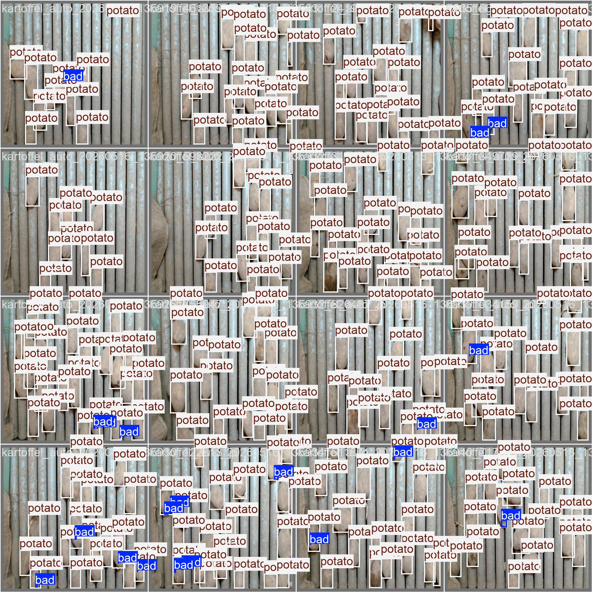
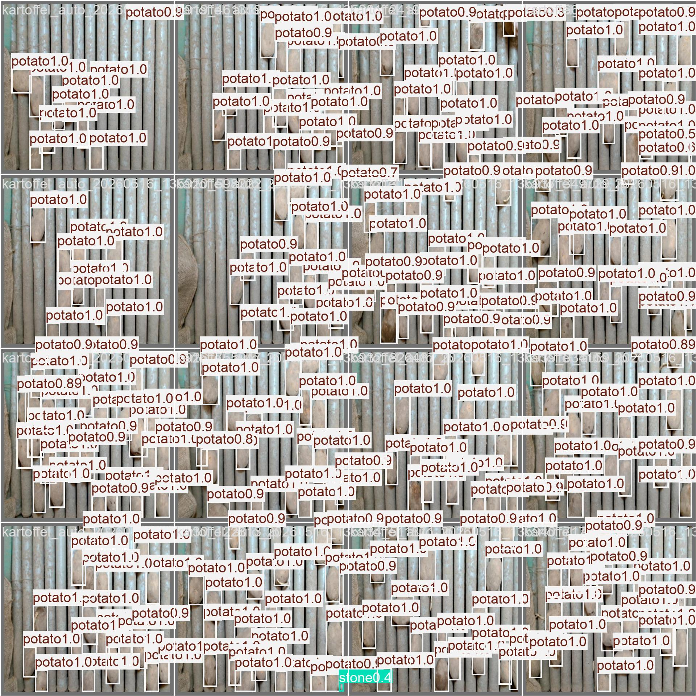
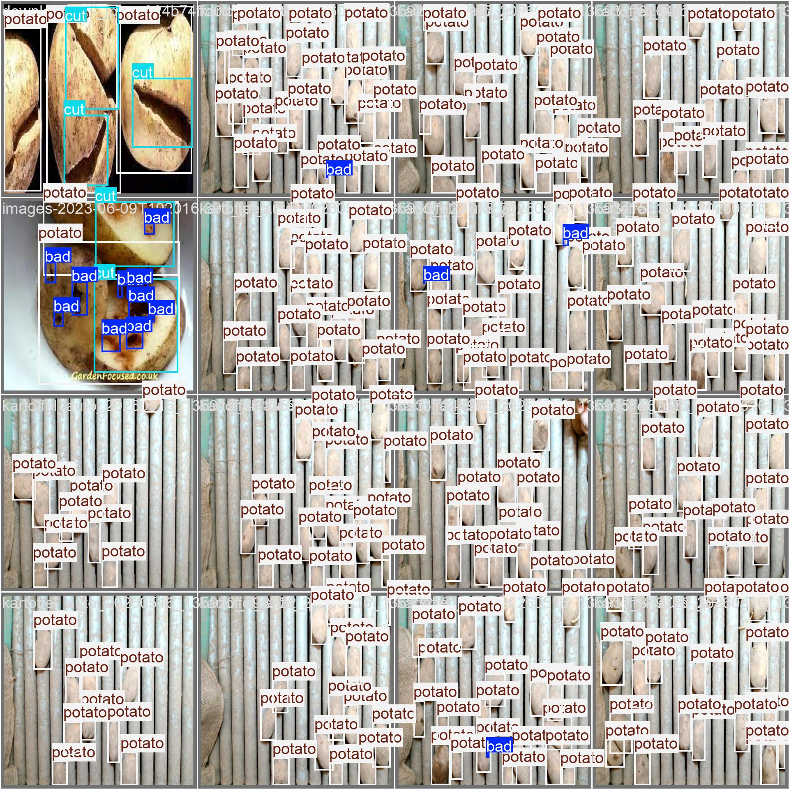
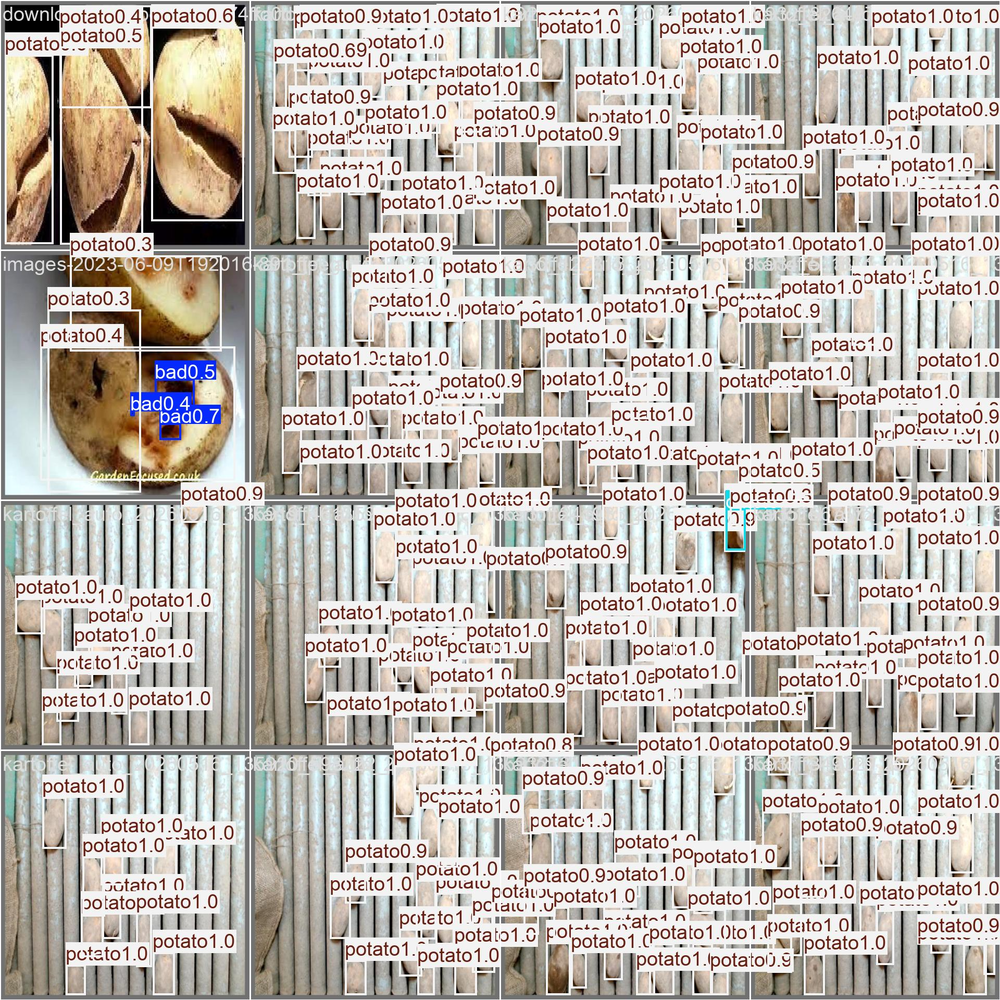

# Model Iterations & Design Decisions — Potato Sorting

This document summarizes the improvements and design decisions made during the YOLO model
development for the potato sorter — including the rationale behind each decision.

Classes: `potato`, `stone`, `bad`, `cut`
Target platform: NVIDIA Jetson (hence the focus on small, fast models)
Training: Google Colab (Tesla T4), Ultralytics YOLO, dataset via Roboflow

---

## 1. Starting Point (Iteration 1)

**Setup:** YOLOv8n, 50 epochs, `imgsz=640`, standard augmentation, linear LR.

**Result:**

| Metric | Value |
|---|---|
| mAP@50 (overall) | 0.636 |
| mAP@50-95 (overall) | ~0.53 |
| `potato` / `stone` mAP@50 | 0.994 / 0.977 |
| `bad` Recall (normalized) | 0.09 |
| `cut` Recall (normalized) | 0.25 |

**Diagnosis:** Good potatoes and stones were detected nearly perfectly, but the
**reject-critical defect classes `bad` and `cut` were practically missed**
(0.91 and 0.75 classified as background, respectively).

**Root cause:** Extreme class imbalance — `potato` 23,504 instances, `bad` 1,913,
`stone` 1,222, `cut` only **46**. The problem was the **data situation**, not the architecture.

**Sample images — Iteration 1** (same validation images):

Ground Truth (real labels):

Predictions after training:

---

## 2. Key Insight: Augmentation ≠ Class Balance

Standard augmentation (flip, HSV, mosaic) **only multiplies the existing few
objects** — it does not generate new information about the visual diversity of defects.
`mosaic=1.0` even further dilutes rare classes. Therefore, targeted measures were necessary.

---

## 3. Measures & Rationale

### 3.1 Offline Copy-Paste Augmentation (Primary Measure for Defects)
- **What:** Real `bad`/`cut` patches are cut out and pasted onto training images in many positions,
  sizes, and rotations (with soft edges). New YOLO labels are generated automatically.
- **Why:** Increases the **instance and positional diversity** of rare classes in a targeted manner —
  the strongest lever with only 46 `cut` instances. Applied only to the **training set**
  (the validation set remains unmodified → clean methodology).
- **Refinement (Iteration 4):** Weighting **bad:cut = 70:30**, since `bad` is visually much
  more diverse than `cut` and requires more examples.

### 3.2 Additional Real, Hand-Labeled Data
- **What:** Suitable public images were found and **hand-labeled within the Roboflow project**
  (new dataset version 8).
- **Why:** Hand-labeling ensures that the **class IDs correctly match** the project schema
  (`bad/cut/potato/stone`) — no erroneous remapping of foreign taxonomies.

### 3.3 Dynamic Learning Rate (Cosine Annealing)
- **What:** `cos_lr=True` instead of linear LR decay.
- **Why:** Converges more cleanly/faster in the final epochs. The training curves
  showed that the model had not yet fully converged.

### 3.4 `mixup=0.15`
- **Why:** Blends image pairs and empirically helps **minority classes** (bad, cut).

### 3.5 `cls=0.7` (Higher Classification Loss Weight)
- **Why:** Places more weight on the (difficult) classification of hard classes.

### 3.6 Higher Resolution `imgsz=768`
- **Why:** Defects are **small objects**; recall of small objects scales strongly with
  input resolution. Recommendation: Export from Roboflow using **"Fit" instead of "Stretch"**
  to avoid distorting the elongated potato shape.

### 3.7 More Generous Early Stopping (`patience=20`, `epochs=100`)
- **Why:** Iteration 2 stopped at epoch 23 while recall was still rising — too early.

---

## 4. Iteration Results Overview

| Iteration | Key Change | mAP@50 | `bad` Recall | `cut` Recall | Early Stop |
|---|---|---|---|---|---|
| 1 | Baseline (YOLOv8n, 50 ep) | 0.636 | 0.09 | 0.25 | – |
| 2 | + hand-labeled data (v8); **cos_lr/mixup NOT active** | ~0.64 | 0.04 | 0.00 | ep 23 |
| 3 | + Copy-Paste + cos_lr + mixup **active** (YOLOv8n) | **0.72** | **0.245** | **0.741** | ep 59 |
| 4 | Benchmark winner **YOLO11s**, imgsz=768, cls=0.7, bad-weighted Copy-Paste | **0.746** | **0.878** | **0.875** | ep 96 |

**Key lesson (Iteration 3):** Copy-Paste augmentation + activated LR/mixup levers
brought **`cut` from 0.00 to 0.74 recall** and roughly tripled `bad`. This confirms the
core hypothesis: defect detection was a **data/instance problem**.

**Key lesson (Iteration 4):** With `YOLO11s` + higher resolution + targeted
augmentation, **`bad` recall rose to 0.878** (previously 0.245) — the largest jump of the
project. However, at the **cost of `bad` precision** (massive false positives, see 5.2).

---

## 5. Model Comparison (Iteration 4)

- **What:** Multiple architectures benchmarked under identical configuration:
  `yolov8n`, `yolov8s`, `yolo11n`, `yolo11s` (newer generation).
- **Why:** After Nano plateaued on the richer data, it might simply lack **capacity**
  for the hard classes. `s` models and YOLO11 are tested fairly against the baseline.
- **Selection criterion:** Ranked by **`bad` recall** (most reject-critical class), then mAP@50.
- **Note:** On a single T4 GPU, models run **sequentially** (not truly in parallel).
  Recommendation: for a quick comparison, run a few epochs first, then fully train only
  the winner.

### 5.1 Inter-Training Evaluation
- **What:** Each model is **validated immediately after training**, with instant
  per-class output and a running leaderboard.
- **Why:** Early feedback; broken runs are caught immediately instead of after hours.
  The comparison cell reuses the collected results (no duplicate validation).

### 5.2 Result Details: Winner YOLO11s (Iteration 4)

**Configuration:** `yolo11s.pt`, `imgsz=768`, `epochs=100` (Early Stop at **96**,
`patience=20`), `batch=0.85`, `cache=True`, `cos_lr=True`, `mixup=0.15`, `cls=0.7`, dataset v8.

**Per-class evaluation (best model ≈ epoch 76):**

| Class | #Val | Recall | AP@0.5 | vs. Iteration 3 |
|---|---|---|---|---|
| `bad` | 49 | **0.878** | **0.441** | Recall 0.245 → 0.878 (**3.6×**), AP 0.214 → 0.441 |
| `cut` | 8 | **0.875** | 0.559 | Recall 0.741 → 0.875 |
| `potato` | 1504 | 0.995 | 0.995 | ~unchanged |
| `stone` | 35 | 0.800 | 0.989 | Recall 1.00 → 0.80 (regression) |
| **overall** | 1596 | — | **0.746** | mAP@0.5 0.72 → 0.746 |

**Training dynamics:** smooth convergence; best mAP@0.5:0.95 at epoch 76 (0.611). The
sharp drop in `train/box_loss` at epoch 91 (0.44 → 0.37) comes from `close_mosaic=10`
(mosaic is disabled for the last 10 epochs). Compute cost: ~90 s/epoch →
~2.4 h for this single model (yolo11s + 768 px), vs. ~23 s/epoch for the Nano baseline at 640.

**Why YOLO11s won:** The benchmark ranks by **`bad` recall**; the higher capacity
compared to Nano clearly helped the visually heterogeneous `bad` class.

**Sample images — Iteration 4 (YOLO11s)** (same validation images):

Ground Truth (real labels):

Predictions after training:

#### 5.2.1 ⚠️ Critical Trade-off: `bad` Precision Collapses
- The **raw** confusion matrix (operating point conf=0.25) shows **1,391 false-positive `bad` boxes**
  on background regions (plus 167 `potato`, 109 `cut`, 57 `stone`). This puts
  `bad` precision at the default operating point at ≈ **0.03** — the model "calls" `bad` everywhere.
- **Cause:** `cls=0.7` + `mixup` + **70/30 Copy-Paste weighting in favor of `bad`** trained
  the model toward overly aggressive `bad` predictions.
- **Not a hopeless case, but a threshold problem:** The PR curve shows `bad`
  precision of ~0.9 at low recall and ~0.5 around recall 0.37–0.5. A usable
  operating point exists at a **higher confidence threshold** (see threshold analysis, Section 6).
- **Consequence:** Recall alone is misleading; for evaluation/deployment, the
  **`bad` confidence threshold must be chosen deliberately** (recall vs. false ejection rate).

#### 5.2.2 Regressions / Caveats
- **`stone` recall 1.00 → 0.80:** 7 out of 35 stones are predicted as `potato` — a small
  but real regression (monitor).
- **`cut` AP apparently decreased (0.688 → 0.559):** with only **8** val instances, this is
  statistical noise; recall increased.
- **Confounded experiment:** Iteration 4 changed model (`yolo11s`), resolution (768),
  `cls` (0.7), and Copy-Paste weighting simultaneously → the `bad` jump **cannot be attributed
  to any single factor** (test separately for a clean ablation).

### 5.3 Final Test-Set Results (Unbiased)

One-time evaluation of the winning model `yolo11s` (best.pt) on the **previously untouched
test split** (62 images, 1,203 instances). These numbers were used neither for training nor for
model selection and therefore represent the **honest, publishable performance estimate**.

| Class | #Test | Precision | Recall | mAP@0.5 | mAP@0.5:0.95 |
|---|---|---|---|---|---|
| `bad` | 20 | 0.727 | 0.250 | 0.347 | 0.134 |
| `cut` | 3 | 0.606 | 0.667 | 0.654 | 0.482 |
| `potato` | 1089 | 0.995 | 0.995 | 0.995 | 0.979 |
| `stone` | 91 | 0.977 | 0.956 | 0.980 | 0.905 |
| **overall** | 1203 | 0.826 | 0.717 | **0.744** | **0.625** |

**Interpretation:**
- **Good generalization in aggregate:** Test mAP@0.5 = **0.744** ≈ Val mAP@0.5 = 0.746. There is
  practically **no overfitting to the validation set** at the aggregate level — the model selection process was clean.
- **`potato`/`stone` production-ready:** `potato` mAP@0.5 0.995, `stone` mAP@0.5 0.980
  (Recall 0.956). Importantly: the **`stone` regression (0.80)** observed on the val set was
  **val noise** (only 35 val instances); on the larger test split (91 instances), `stone`
  is stable at 0.956 recall. → Concern resolved.
- **`bad` remains the weak spot:** Test AP@0.5 = 0.347 (Val 0.441) — a moderate decline, but
  within the range of noise. The "`bad` recall 0.878" observed on the val set applied
  at the operating point conf=0.25 (with massive false positives); at the **F1-optimal threshold**,
  test recall is only **0.25** (precision 0.727). This is **not a contradiction**, but
  the same precision/recall trade-off from a different perspective: high `bad` recall is only
  achievable at the cost of many false alarms → choose the operating point deliberately.
- **`cut` not evaluable:** only **3** real test instances (recall 0.667 = 2 out of 3). Statistically
  meaningless.
- **Core limitation:** The test set contains only **20 `bad` and 3 `cut` instances**. The defect
  numbers are therefore unbiased but **noisy**. The most important measure remains: label more real
  defects in **test AND val**.

**Publishable metric:** mAP@0.5 = **0.744**, mAP@0.5:0.95 = **0.625** (overall, test split).

---

## 6. Evaluation Strategy

- **Per-class metrics instead of overall mAP only:** The aggregate values are dominated by `potato`/`stone`
  and **obscure** the weak defect detection. An explicit table per class
  (including the number of real val instances) makes `bad`/`cut` visible.
- **Warning for small val sets:** With < 30 real instances of a defect class, the
  recall/mAP is **statistically unreliable** (e.g., only 8 real `cut` instances). → Label more real
  defects into the **val set** as well (target: ~30–50 per class).
- **Threshold analysis (operating point):** For a sorter, a **missed bad potato
  (false negative) is worse than a false ejection**. Precision/recall over confidence
  per class shows which confidence threshold achieves the target recall. Since YOLO's `conf`
  is **global**, class-specific fine-tuning (e.g., `bad` low) is implemented in
  post-processing (`code/jetson/vision/logic.py`).

---

## 7. Roboflow Preprocessing / Augmentation — Notes

- **Resize "Stretch to 512×512"**: distorts the elongated potato shape → better to use **"Fit"**.
- **Auto-Adjust Contrast (Contrast Stretching)**: gets "baked into" the training → the
  **Jetson camera pipeline must replicate the same preprocessing**, otherwise domain mismatch.
- **"Outputs per training example: 3"** (including 90° rotations): multiplies **all** classes
  equally → does **not** change the imbalance.

---

## 8. Workflow & Infrastructure

- **Cause of delayed improvements:** "Open in Colab" loads the notebook from **GitHub**,
  not the local copy. Changes must therefore be **committed and pushed** before they
  take effect in Colab. (This explained why cos_lr/mixup were not active in Iteration 2.)
- **Security:** The hard-coded Roboflow API key was removed and replaced with **Colab Secrets**
  (`userdata.get('ROBOFLOW_API_KEY')`). The already exposed key should be **rotated**
  (public Git history).

### 8.1 GPU Utilization / Resource Usage
- **Observation:** During the Iteration 4 benchmark, the T4 was underutilized
  (~4.6/15 GB GPU RAM, ~31%). Cause: `batch=-1` (AutoBatch) targets only **~60%**
  GPU RAM, and Nano models are very small.
- **Measures:**
  - `batch=0.85` — AutoBatch as a **fraction** targets ~85% GPU RAM → larger batches,
    better throughput (especially the `s` models benefit).
  - `cache=True` — Cache images in RAM/disk (reserves available) → faster loading,
    I/O is no longer a bottleneck.
- **Limits:** With the tiny Nano models, **compute** performance (not memory) is often
  the bottleneck — they may not fill the GPU RAM regardless. And on **one**
  GPU, models remain **sequential**; true parallelism would require multiple GPUs.

---

## 9. Open Items / Next Steps

- [ ] Label more real `bad` and especially `cut` images (train **and** val).
- [ ] Bring the val set to ~30–50 real instances per defect class (reliable metrics).
- [ ] Switch Roboflow export to **"Fit"**; possibly native/higher resolution.
- [x] Iteration 4 benchmark evaluated → winner **YOLO11s** (bad recall 0.878).
- [x] Final test-set evaluation completed → overall mAP@0.5 **0.744**, mAP@0.5:0.95 **0.625**.
- [x] `stone` regression clarified: was val noise, stable on test (recall 0.956).
- [ ] **Solve the `bad` precision problem:** Choose operating point/confidence threshold for `bad` deliberately
      (1,391 false positives at conf=0.25); possibly reduce Copy-Paste weighting.
- [ ] Implement class-specific confidence thresholds in the Jetson post-processing.
- [ ] Export winning model for the Jetson (e.g., TensorRT/FP16).
- [ ] Ensure that the Jetson preprocessing replicates the Roboflow preprocessing.
