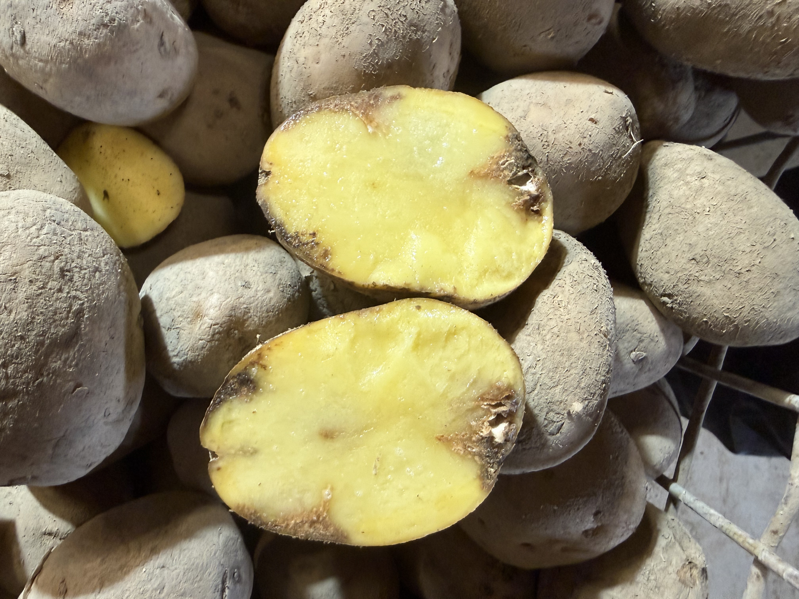
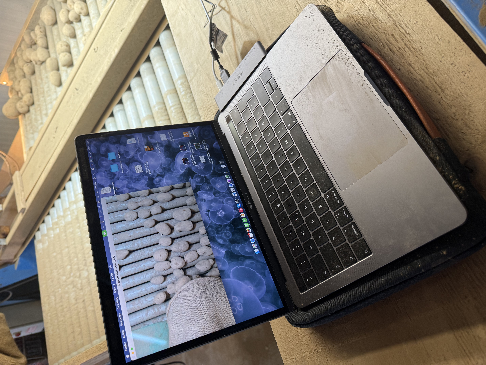
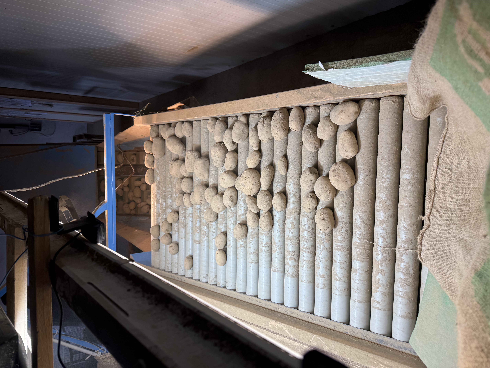

# Previous Preparations: Data Collection and Initial Steps

## 1. Background and Motivation
**The Journey of the Potato:**
Potatoes are harvested from the field using a harvester, where a first rough sorting takes place directly on the machine. Once in the processing hall, they pass through a shaking and sorting machine which divides the harvest into three different size classes.

**The Current Problem:**
Currently, up to four people stand at the conveyor belts at this station, whose task is to manually sort out bad potatoes, stones, and dirt. The remaining good potatoes are then stored in the cold store. Later, when they are packed and shipped according to customer requirements, another manual inspection step takes place before packaging. This process is currently extremely personnel- and time-intensive.

**Project Objectives:**
To reduce this personnel requirement, the sorting process is to be automated. A camera system is supposed to automatically detect bad potatoes as well as foreign objects (like stones) to sort them out. A valve terminal, connected via the GPIO pins of the Jetson, handles the separation/ejection.

## 2. Project Context and Machine Setup
- **Machine Setup:** The facility uses a conveyor belt with rotating rollers. This causes the potatoes to rotate as they are transported forward, allowing the camera system to capture them from all sides.
- **Seasonal Differences:**
  - **Summer:** The potatoes come out of the cold store relatively clean. The focus of this project is on automating the final quality control during retrieval/packaging in this phase.
  - **Autumn (Harvest Time):** Fresh potatoes straight from the earth are significantly dirtier, often damaged by the harvester, and accompanied by many clods of earth. This more difficult use case is explicitly **not** the subject of the current work.
- **Classification:** Image recognition focuses on detecting potatoes (`potato`), specific defects (`bad`), and foreign objects (`stone`).

## 3. Image Acquisition Setup
- **Camera Setup:** Initial tests were conducted with a standard webcam connected to a MacBook.
- **Capture Interval:** An image was automatically triggered and saved every 0.5 seconds.
- **Environmental Conditions:**
  - The conveyor belt was well illuminated.
  - The belt speed was set as slow as possible to maximize image quality.

### Camera Angle at the Conveyor Belt
To simulate the classification process as realistically as possible, the following camera setup was built, showing the viewing angle onto the belt:

### Classification of Defects
To create uniform criteria for labeling and clearly assign defects, reference examples for bad and damaged potatoes were defined:

### Data Collection Process (Video)
The following video demonstrates the recording process at the belt in action:

https://github.com/user-attachments/assets/8d01e8c6-1edd-42d0-8253-a1c278131b8d

## 4. Initial Findings and Challenges
- **Problems with Defect Detection and Throughput:** It was noticed that the webcam does not capture and detect specific defects like shriveled potatoes well. Furthermore, the camera setup is the primary bottleneck for increasing the conveyor belt speed.
- **Causes:** The webcam's resolution is too low. In addition, the camera's high exposure/shutter time causes slightly blurred images of the moving potatoes (motion blur).
- **Proposed Solution:** For future operation, the use of a professional industrial camera (preferably with a global shutter and higher resolution) is highly recommended. This will not only improve defect detection but is absolutely necessary to eliminate motion blur at higher, industrially realistic belt speeds.

## 5. Data Processing and Model Training in Roboflow
- **Upload & Dataset:** All collected images were uploaded to the free platform **Roboflow**. The dataset is publicly available as an open-source project: [Potato Sorting on Conveyor Dataset (Roboflow Universe)](https://universe.roboflow.com/ms-workspace-m1gci/potato-sorting-on-conveyor). The final dataset on the platform comprises:
  - **855 images** (Median resolution: 1920x1080)
  - **17,511 annotations** in total (average of 20.5 bounding boxes per image)
  - **Class distribution of labeled objects:** 
    - 16,271x *potato*
    - 778x *stone*
    - 399x *bad*
    - 63x *cut*
  *(Note: Since shriveled potatoes were difficult to detect due to camera blur, these defects were likely only partially captured during labeling).*
- **Labeling Process:**
  1. First, the first 200 images were manually labeled to create a data baseline.
  2. Based on these 200 images, an initial object detection model was trained in Roboflow.
  3. This pre-trained model was then used to semi-automatically pre-label the remaining images (Assisted Labeling). This significantly accelerated the rest of the labeling process.
- **Preprocessing & Data Augmentation:** 
  To make the model more robust for training, the following steps were applied in Roboflow:
  - **Preprocessing:** Auto-Orient (applied), Resize (Stretch to 512x512)
  - **Augmentations (2 outputs per training image):** Rotation (between -15° and +15°), Blur (up to 1px).

## 6. Planned System Architecture and Hardware Concept (From Previous Planning)
Based on previous evaluations, the following technical framework emerges for the final system:
- **Hardware Core:** An Nvidia Jetson Orin Nano (with 500GB SSD) will serve as an edge device (standalone) to read the camera and run the AI locally.
- **Artificial Intelligence:** The use of a pre-trained **YOLOv8n model** (YOLOv8 Nano) is planned. This provides object detections (bounding boxes) for potatoes and stones, as well as pointwise detections for bad spots and cuts.
- **Object Tracking:** Since the potatoes move and rotate on the belt, each object must receive a continuous ID via a tracking algorithm (e.g. ByteTrack) to track it until ejection.
- **Actuators (Sorting):** Bad potatoes and stones are sorted out via a valve terminal. The valves are controlled directly by the GPIO pins of the Jetson via a relay module, depending on the spatial position of the potato on the conveyor belt.
- **Software & UI:** 
  - A local web server on the Jetson provides a web app (React/Vite) as a control dashboard.
  - The dashboard displays the live video stream from the camera, current statistics, and offers configuration options.
  - Logic in the interface should allow defining tolerance values (e.g. what size of bad spots is still acceptable) and switching models.
  - Production data is logged in a local database.
- **Setup Challenges:** During the initial setup of the CUDA and PyTorch environment on the Nvidia Jetson, typical edge deployment hurdles (such as conflicts with `libcudnn` versions) already appeared, which must be carefully documented and resolved.

## 7. Outlook and Future Optimizations
Based on findings so far, the following approaches emerge for further development of the system:
- **Two-Camera Setup:** It has been shown that potatoes on the outer edges (sides) of the conveyor belt are not always optimally captured. In the future, a setup with two cameras might be necessary to avoid blind spots and better illuminate and film the sides.
- **Logic for Fine-Grained Defect Detection:** Defect detection is already anchored in the dataset, since general potatoes (`potato`) and defective spots (`bad`) were labeled separately. In the future, the software logic should be programmed so that potatoes in whose area a defect (`bad`) is detected can dynamically be counted as a "bad potato". This offers the great advantage that exact threshold values can later be set in the interface. Depending on current production requirements, it can be flexibly decided from what size or number of defects a potato is considered reject (and not across the board at the smallest scratch).
